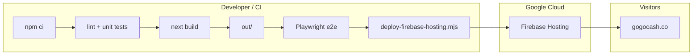

# GoGoCash — Marketing landing (Next.js)

Production marketing site for **GoGoCash**, built as a **static export** from **Next.js 16** and served from **Firebase Hosting** (custom domain: `gogocash.co`). The stack emphasizes fast static delivery, localized landing paths, optional partner data at build time, and pluggable analytics (Firebase, LINE Tag, PostHog).

This document is the **canonical onboarding guide** for the repo. Topic-specific runbooks live under [`docs/`](./docs/).

---

## Table of contents

1. [Architecture](#architecture)
2. [Repository layout](#repository-layout)
3. [Prerequisites](#prerequisites)
4. [Quick start](#quick-start)
5. [Environment variables](#environment-variables)
6. [npm scripts](#npm-scripts)
7. [Local development](#local-development)
8. [Production build](#production-build)
9. [Firebase Hosting & Functions](#firebase-hosting--functions)
10. [Cloudflare DNS (apex → Firebase)](#cloudflare-dns-apex--firebase)
11. [CI/CD (GitHub Actions)](#cicd-github-actions)
12. [Testing](#testing)
13. [Linting & typecheck](#linting--typecheck)
14. [Patches & tooling notes](#patches--tooling-notes)
15. [Further reading](#further-reading)
16. [Troubleshooting](#troubleshooting)

---

## Architecture

| Layer | Choice | Notes |
|--------|--------|--------|
| Framework | Next.js 16 (App Router) | `output: "export"` → static HTML in `out/` |
| Styling | Tailwind CSS 3.4 | `tailwind.config.ts`; [`patches/tailwindcss+3.4.18.patch`](./patches/tailwindcss+3.4.18.patch) via `patch-package` |
| Motion | Framer Motion | Tree-shaken via `experimental.optimizePackageImports` in [`next.config.mjs`](./next.config.mjs) |
| Content | React 18, `react-markdown` | Learn hub and legal pages |
| Hosting | Firebase Hosting | `public: "out"` in [`firebase.json`](./firebase.json) |
| Optional API | Firebase Cloud Functions | PostHog reverse proxy at `/w/**` (Blaze) — see [`functions/README.md`](./functions/README.md) |
| E2E | Playwright | Serves `out/` with `serve` when `CI=true` — see [`playwright.config.ts`](./playwright.config.ts) |

High-level deploy path:



**Important:** This app is **not** Firebase App Hosting and **not** a Node server in production. There is no `next start` on Firebase; the live site is **static files** only (unless you add rewrites to Functions).

---

## Repository layout

| Path | Purpose |
|------|---------|
| [`app/`](./app/) | App Router routes: home, locale roots (`/en`, `/th`, `/id`, `/ja`, `/tw`), learn hub, search, legal, about, etc. |
| [`components/`](./components/) | Shared UI: header, footer, landing sections, analytics wrappers, locale menu, legal shell |
| [`lib/`](./lib/) | Config (`app-config.ts`), SEO helpers, analytics helpers, routing utilities, tests colocated as `*.test.ts` |
| [`public/`](./public/) | Static assets (images, icons) copied into `out/` |
| [`functions/`](./functions/) | Firebase Functions (PostHog proxy) — separate `package.json` |
| [`e2e/`](./e2e/) | Playwright specs |
| [`scripts/`](./scripts/) | Deploy helper, Cloudflare DNS, dev helpers, optional Strapi push |
| [`docs/`](./docs/) | Deploy, PostHog, migration from Framer, etc. |
| [`.github/workflows/`](./.github/workflows/) | `build-landing.yml` — build, test, e2e, artifact, Firebase deploy |

---

## Prerequisites

- **Node.js 20+** (matches CI and `engines` in `package.json`; Firebase tooling expects a supported LTS.)
- **npm** (lockfile is `package-lock.json`; use `npm ci` in CI and for reproducible installs).
- For **local Firebase deploy**: Firebase CLI is available as a **devDependency** — prefer `npm exec -- firebase` from the repo root.
- For **Cloudflare DNS scripts**: `curl`, `jq`, and a Cloudflare API token (see [Cloudflare DNS](#cloudflare-dns-apex--firebase)).
- For **Playwright locally**: after `npm ci`, run `npm run test:e2e:install` once to download browsers.

---

## Quick start

```bash
git clone <repository-url>
cd landing-page-main
npm ci          # runs patch-package via postinstall
cp .env.example .env.local   # optional; see Environment variables
npm run dev
```

Open `http://127.0.0.1:3000` (dev server binds `0.0.0.0:3000`).

---

## Environment variables

Variables are documented inline in **[`.env.example`](./.env.example)**. Below is a consolidated reference.

### Build-time / runtime (Next.js)

| Variable | Required | Purpose |
|----------|----------|---------|
| `NEXT_PUBLIC_SITE_URL` | Recommended for prod builds | Canonical public URL (metadata, OG, sitemap). Falls back to `VERCEL_URL` or defaults in code. |
| `INVOLVE_ASIA_API_KEY` / `INVOLVE_ASIA_API_SECRET` | Optional | If set, build can pull live partner/offer data; otherwise bundled/static behavior is used. |
| `INVOLVE_ASIA_MAX_OFFER_PAGES` | Optional | Caps Involve Asia pagination during build. |
| `NEXT_PUBLIC_FIREBASE_*` | Optional | Override public Firebase web config (defaults live in [`lib/app-config.ts`](./lib/app-config.ts)). |
| `NEXT_PUBLIC_ANALYTICS_ENABLED` | Optional | `true` / `false` — gates marketing analytics defaults. |
| `NEXT_PUBLIC_LINE_TAG_ID` | Optional | Empty string disables LINE Tag; must look like a UUID when set. |
| `NEXT_PUBLIC_LINE_TAG_ENABLED` | Optional | Force LINE Tag on/off when an id exists. |
| `NEXT_PUBLIC_POSTHOG_KEY` | Optional | PostHog project key (`phc_…`). No key → PostHog not initialized. |
| `NEXT_PUBLIC_POSTHOG_HOST` | Optional | Ingest API origin or **your proxy** (e.g. `https://gogocash.co/w`). See [`docs/posthog-events.md`](./docs/posthog-events.md). |
| `NEXT_PUBLIC_POSTHOG_UI_HOST` | Optional | PostHog app origin for toolbar/flags when ingest is proxied. |
| `NEXT_PUBLIC_POSTHOG_ENABLED` | Optional | Explicit enable/disable. |

**Critical:** `NEXT_PUBLIC_*` values are **inlined at `next build`**. Changing them requires a **rebuild** and **redeploy**. For GitHub Actions, set repository secrets and pass them into the build step as in [`.github/workflows/build-landing.yml`](./.github/workflows/build-landing.yml).

### Local-only files (never commit secrets)

| File | Purpose |
|------|---------|
| `.env.local` | Local Next.js overrides (gitignored by default pattern). |
| `.env.production.local` | Production-like local builds without committing keys. |
| `.env.cloudflare` | `CLOUDFLARE_API_TOKEN`, `CLOUDFLARE_ZONE_ID` for DNS automation (gitignored). Template: [`.env.cloudflare.example`](./.env.cloudflare.example). |

---

## npm scripts

| Script | What it does |
|--------|----------------|
| `npm run dev` | Next dev server (Turbopack), port 3000. |
| `npm run build` | Static export → `out/`. |
| `npm run start` | `next start` — **not** used for Firebase production (static hosting only). |
| `npm run lint` | ESLint (flat config in [`eslint.config.mjs`](./eslint.config.mjs)). |
| `npm run test` | Node test runner via `tsx` on `lib/*.test.ts`. |
| `npm run typecheck` | `tsc --noEmit`. |
| `npm run verify` | `lint` + `test` + `typecheck` + `build`. |
| `npm run test:e2e` | Playwright (local: tries dev server with reuse). |
| `npm run test:e2e:ci` | Playwright with `CI=true` behavior from config (serves `out/`). |
| `npm run test:e2e:install` | Install Chromium + WebKit for Playwright. |
| `npm run deploy:firebase` | `build` + [`scripts/deploy-firebase-hosting.mjs`](./scripts/deploy-firebase-hosting.mjs) (hosting only). |
| `npm run deploy:firebase:full` | `build` + `firebase deploy --only hosting,functions`. |
| `npm run dns:cloudflare-firebase-apex` | Load `.env.cloudflare` and run Cloudflare apex DNS helper. |

---

## Local development

- **Standard:** `npm run dev`.
- **Alternative:** `npm run dev:local` runs [`scripts/dev-local.sh`](./scripts/dev-local.sh) if you keep machine-specific steps there.
- **Webpack dev:** `npm run dev:webpack` if you need to compare Turbopack vs Webpack behavior.

Hot reload and HMR work against the dev server; **always validate production output** with `npm run build` because the live site is static export, not SSR.

---

## Production build

```bash
npm run build
```

Artifacts land in **`out/`**. [`next.config.mjs`](./next.config.mjs) sets `output: "export"` and `images.unoptimized: true` (required for static export with remote images as configured).

Preview static output locally (similar to CI):

```bash
npx --yes serve@14 out -l 3000
```

---

## Firebase Hosting & Functions

| Item | Value |
|------|--------|
| Default GCP / Firebase project | `landing-page-4ae23` ([`.firebaserc`](./.firebaserc)) |
| Hosting site id | `landing-page-4ae23` ([`firebase.json`](./firebase.json)) |
| Deployed static root | `out/` |

**Deploy hosting only (after build):**

```bash
npm run deploy:firebase
```

**Deploy hosting + Cloud Functions** (PostHog proxy, requires Blaze and configured rewrites — read the warning in [`functions/README.md`](./functions/README.md)):

```bash
npm run deploy:firebase:full
```

Full operational detail, billing, and “do not run `firebase init` for App Hosting” notes: **[`docs/firebase-deploy.md`](./docs/firebase-deploy.md)**.

---

## Cloudflare DNS (apex → Firebase)

Firebase **Quick setup** for a custom apex domain expects an **`A` record** for the apex pointing to **`199.36.158.100`**, and (for verification / SSL) traffic must reach **Firebase**, not Cloudflare’s reverse proxy.

**Common mistake:** Creating the correct `A` record but leaving **Proxied** (orange cloud) **on**. Public DNS then returns **Cloudflare anycast IPs**, Firebase’s ACME HTTP checks fail (e.g. **526**), and the console still asks to remove old `A`/`AAAA` answers.

This repo includes:

- [`scripts/cloudflare-firebase-dns-setup.sh`](./scripts/cloudflare-firebase-dns-setup.sh) — removes legacy Framer-style apex `A`/`AAAA` targets when present, ensures Firebase apex `A`, and **turns off proxy** if the Firebase `A` exists but is still proxied.
- [`scripts/run-cloudflare-firebase-dns.sh`](./scripts/run-cloudflare-firebase-dns.sh) — sources **`.env.cloudflare`** then runs the setup script.

```bash
cp .env.cloudflare.example .env.cloudflare
# edit .env.cloudflare — use a token with Zone → DNS → Edit for the zone only

npm run dns:cloudflare-firebase-apex
# optional: DRY_RUN=1 npm run dns:cloudflare-firebase-apex
```

---

## CI/CD (GitHub Actions)

Workflow: **[`.github/workflows/build-landing.yml`](./.github/workflows/build-landing.yml)** (`Build and deploy landing`).

| Step | Action |
|------|--------|
| Trigger | Push to `main`, or `workflow_dispatch` |
| Install | `npm ci` |
| Quality | `npm run lint`, `npm run test` |
| Build | `npm run build` (optional `INVOLVE_ASIA_*` from secrets) |
| E2E | `npm run test:e2e:install` then `npm run test:e2e:ci` (serves `out/`) |
| Artifact | Uploads `out/` as `landing-page-out` (1-day retention) |
| Deploy | OIDC → Google Cloud WIF, then `node scripts/deploy-firebase-hosting.mjs` |

**GitHub repository secrets (optional but recommended for partner data):**

- `INVOLVE_ASIA_API_KEY`
- `INVOLVE_ASIA_API_SECRET`

**Google Cloud:** The workflow uses **Workload Identity Federation** (no long-lived JSON key in the repo). Pool / provider / service account IDs are pinned in the YAML; changing projects requires updating those values and IAM bindings in GCP.

---

## Testing

| Layer | Command | Scope |
|--------|---------|--------|
| Unit / integration (light) | `npm run test` | `lib/*.test.ts` (e.g. `app-config`, routing helpers) |
| E2E | `npm run test:e2e` or `npm run test:e2e:ci` | Smoke, navigation, sitemap, mobile overflow — see [`e2e/`](./e2e/) |
| Full gate | `npm run verify` | Lint + unit + typecheck + build |

Playwright projects: **mobile-chrome** (Pixel 5) and **mobile-safari** (iPhone 12), see [`playwright.config.ts`](./playwright.config.ts).

---

## Linting & typecheck

- **ESLint 9** with [`eslint.config.mjs`](./eslint.config.mjs) extending `eslint-config-next` (Core Web Vitals + TypeScript).
- **Ignored paths** in config: `e2e/`, `functions/`, `out/`, etc. Do not remove `node_modules` / `.next` ignore flags from the `lint` script without cause.
- Avoid forcing incompatible **npm overrides** on transitive deps used by ESLint (historically `brace-expansion@5` broke `minimatch` inside `@eslint/config-array`).

---

## Patches & tooling notes

- **`patch-package`**: Applied on `npm install` via `postinstall`. Currently patches **Tailwind** 3.4.18 ([`patches/tailwindcss+3.4.18.patch`](./patches/tailwindcss+3.4.18.patch)). If you upgrade Tailwind, regenerate or remove the patch as needed.
- **Firebase CLI**: Use the **project-local** version (`npm exec -- firebase`) to avoid global/CLI version skew.

---

## Further reading

| Document | Topic |
|----------|--------|
| [`docs/firebase-deploy.md`](./docs/firebase-deploy.md) | End-to-end Firebase Hosting + Functions deploy |
| [`docs/posthog-events.md`](./docs/posthog-events.md) | PostHog events and proxy options |
| [`docs/framer-to-next-migration.md`](./docs/framer-to-next-migration.md) | Migration notes from Framer |
| [`functions/README.md`](./functions/README.md) | PostHog Cloud Function and `/w/**` caveats |

---

## Troubleshooting

| Symptom | Things to check |
|---------|------------------|
| Firebase domain verification / SSL **526** or “remove AAAA” | Apex `A` must be **DNS only** (grey cloud) to `199.36.158.100`. Re-run `npm run dns:cloudflare-firebase-apex` after fixing `.env.cloudflare`. |
| `npm run lint` crashes with `expand is not a function` | Broken `minimatch` / `brace-expansion` mix — remove incompatible `overrides` in `package.json` and run `npm install`. |
| Build works locally, CI fails | Compare Node version (CI uses 20), ensure `npm ci` lockfile is committed, check GitHub Actions logs for the failing step. |
| Firebase deploy auth errors in CI | WIF provider, service account permissions, and `google-github-actions/auth` settings must match the Firebase/GCP project. |
| PostHog proxy 404 | Deploy **Functions** before adding Hosting rewrites to `posthogProxy`; see [`functions/README.md`](./functions/README.md). |
| Empty partner data in build | Set `INVOLVE_ASIA_*` for build, or accept static fallback documented in `.env.example`. |

---

## License

Private repository — **GoGoCash**. Do not redistribute or deploy to unauthorized Firebase projects or domains without explicit approval.
